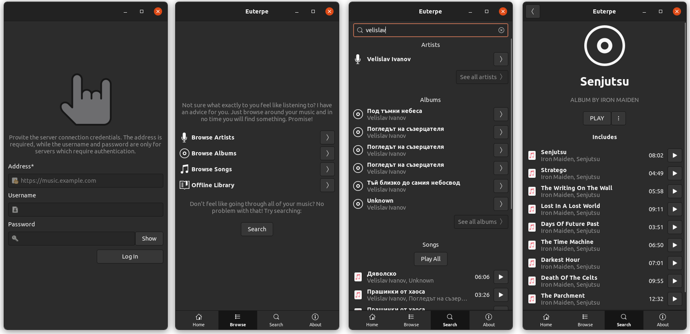

# Euterpe GTK

This is a convergent desktop and mobile client for [Euterpe](https://listen-to-euterpe.eu).
It is developed with mobile Linux environments in mind. Such as
[Phosh](https://developer.puri.sm/Librem5/Software_Reference/Environments/Phosh.html) and
[Plasma Mobile](https://www.plasma-mobile.org/). But it is completely usable as a normal
desktop application as well.

[](repo/alpha-screenshots.png)

<a href="https://flathub.org/apps/details/com.doycho.euterpe.gtk">
    
</a>

## Project Status

The program is mostly done and ready for day-to-day use. It needs some polishing and
adding the last few minor features before I could call it a complete and release the
first major version.

## Requirements

* [Python 3.11](https://www.python.org/)
* GTK+ 3 and its [Python bindings](https://python-gtk-3-tutorial.readthedocs.io/en/latest/install.html)
* [Libhandy 1.2](https://gnome.pages.gitlab.gnome.org/libhandy/)
* [py3-keyring](https://pypi.org/project/keyring/)

## Building From Source

You will need [libhandy 1.2+ dev files](https://gnome.pages.gitlab.gnome.org/libhandy/) and
the Python's [keyring](https://pypi.org/project/keyring/) lib before building.

On Alpine they could be installed via `apk`:

```sh
sudo apk add libhandy1-dev py3-keyring
```

After that install as normal GTK3 app:

```sh
meson . _build --prefix=/usr
ninja -C _build
sudo ninja -C _build install
```

## Development

One would want to set the environment variable `G_MESSAGES_DEBUG=euterpe-gtk` to get
the debug messages from the program. They do help during development a lot!
